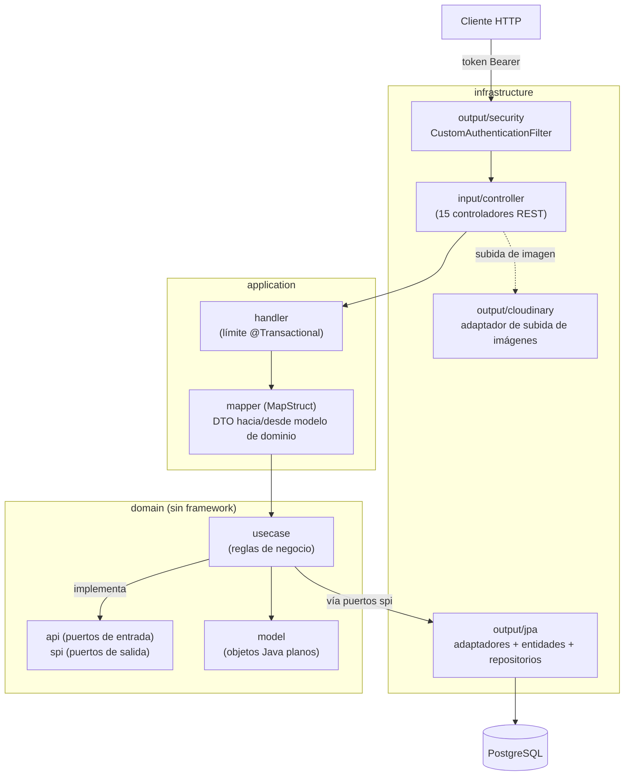

# NegoCore — Backend

Una API REST para gestión de pequeños negocios: productos e inventario,
clientes y proveedores, ventas y compras (con pagos parciales), cuentas por
cobrar y por pagar, gastos, cotizaciones, pedidos previos a venta/compra, un
registro de auditoría y un reporte de balance. Construida con Spring Boot 3 /
Java 21 siguiendo una arquitectura hexagonal (puertos y adaptadores).

- **API en vivo**: https://negocore-backend.onrender.com (Swagger UI en `/swagger-ui/index.html`)
- **Frontend**: https://nego-core-frontend.vercel.app — ver el repo [NegoCore-Frontend](https://github.com/Jhonmario8/NegoCore-Frontend)

> La API corre en el plan gratuito de Render, que apaga la instancia tras un
> rato de inactividad. La primera petición después de eso puede tardar hasta
> ~1 minuto; una GitHub Action programada la "pinguea" cada 10 minutos para
> que esto pase con menos frecuencia (ver
> [`.github/workflows/keep-alive.yml`](.github/workflows/keep-alive.yml)).

## Stack tecnológico

| Aspecto | Elección |
|---|---|
| Lenguaje / runtime | Java 21 |
| Framework | Spring Boot 3.5.4 (Web, Security, Validation, Data JPA) |
| Base de datos | PostgreSQL, vía Hibernate con `ddl-auto: validate` (sin herramienta de migración) |
| Autenticación | JWT (`jjwt` 0.12.7), stateless, filtro propio — sin `UserDetails` de Spring Security |
| Documentación de API | springdoc-openapi (Swagger UI) |
| Almacenamiento de imágenes | Cloudinary (imágenes de productos) |
| Mapeo | MapStruct |
| Build | Gradle 9.5 (wrapper incluido) |
| Tests | JUnit 5 + Mockito |
| CI | GitHub Actions |

## Arquitectura

La capa de dominio tiene **cero imports de Spring o Jakarta** — es Java plano,
testeable de forma independiente y agnóstico de framework. Cada caso de uso
(`domain/usecase/*Service.java`) se conecta manualmente como bean de Spring en
[`BeanConfiguration`](src/main/java/com/negocore/infrastructure/config/BeanConfiguration.java);
ninguno lleva anotación `@Service` propia.



Flujo de una petición: un controlador recibe la petición HTTP y delega en un
`application/handler`, que es dueño del límite `@Transactional`, mapea el DTO
de entrada a un modelo de dominio vía MapStruct, y llama a la implementación
correspondiente en `domain/usecase`. El caso de uso aplica las reglas de
negocio y solo habla con la persistencia a través de los puertos de
`domain/spi` — nunca ve una entidad, un repositorio, ni un concepto de HTTP.

## Funcionalidades

- **Autenticación**: registro/login, contraseñas hasheadas con BCrypt, tokens
  JWT (expiración de 10h), sin refresh tokens.
- **Negocios**: un usuario puede tener varios; todo otro recurso está
  acotado a un negocio que el usuario que hace la petición posee.
- **Catálogo**: categorías, productos (stock, umbral de alerta de stock bajo,
  imagen opcional en Cloudinary).
- **Clientes y proveedores**.
- **Ventas**: pago completo o parcial; una venta parcial requiere un cliente
  y abre automáticamente una `Debt` por el saldo pendiente; cancelar una
  venta pagada o parcialmente pagada repone el stock (bloqueado una vez que
  la deuda vinculada recibió algún pago).
- **Compras**: pago completo o parcial; una compra parcial abre
  automáticamente un `Payable` por el saldo pendiente; aumenta el stock al
  registrarse.
- **Deudas y cuentas por pagar**: pagos manuales contra el saldo pendiente,
  más un préstamo independiente (una `Debt` sin venta asociada).
- **Pedidos**: un borrador previo a venta/compra — agregar/quitar ítems, y
  luego convertir todo el pedido en una compra o convertir un ítem individual
  en una venta.
- **Gastos**.
- **Cotizaciones**: generadas en el servidor, renderizadas/exportadas como
  imagen del lado del cliente.
- **Registro de auditoría**: un historial de actividad paginado y filtrable
  por negocio.
- **Reporte de balance**: ingresos vs. gastos en un rango de fechas.

## Primeros pasos

### Requisitos previos

- JDK 21
- Una base de datos PostgreSQL (local, Docker, o una instancia alojada como Neon)

### Configuración

Toda la configuración es vía variables de entorno — nada está hardcodeado, y
no se lee ningún archivo `.env` directamente (Spring las lee del entorno del
proceso). Ninguna de estas tiene valor por defecto salvo donde se indica, así
que la app fallará al iniciar sin ellas:

| Variable | Requerida | Descripción |
|---|---|---|
| `NC_DB_URL` | sí | URL JDBC, p. ej. `jdbc:postgresql://localhost:5432/negocore` |
| `NC_DB_USERNAME` | sí | Usuario de la base de datos |
| `NC_DB_PASSWORD` | sí | Contraseña de la base de datos |
| `NEGOCORE_JWT_KEY` | sí | Clave HMAC para firmar los JWT |
| `NC_CLOUDINARY_CLOUD_NAME` | sí | Cloud name de Cloudinary |
| `NC_CLOUDINARY_API_KEY` | sí | API key de Cloudinary |
| `NC_CLOUDINARY_API_SECRET` | sí | API secret de Cloudinary |
| `CORS_ALLOWED_ORIGINS` | no | Orígenes permitidos separados por coma; por defecto usa los puertos locales de Vite |
| `PORT` | no | Puerto del servidor; por defecto `8080` |

### Correr localmente

```bash
./gradlew bootRun
```

### Testear y compilar

```bash
./gradlew build
```

## Testing

78 tests unitarios con JUnit 5 + Mockito cubren cada clase de
`domain/usecase` — tests de lógica de negocio pura, con puertos mockeados,
sin contexto de Spring y sin base de datos.
`NegoCoreApplicationTests.contextLoads()` está deshabilitado a nivel de
clase porque de lo contrario levantaría todo el contexto de Spring y
requeriría una conexión real a la base de datos; esto mantiene
`./gradlew build` ejecutable en CI y en una laptop sin ninguna base de datos
configurada.

Actualmente **no hay tests de integración** contra los adaptadores JPA, los
repositorios, ni los controladores.

## CI

[`.github/workflows/ci.yml`](.github/workflows/ci.yml) corre
`./gradlew build` (compilación + tests unitarios) en cada push y pull
request a `main`.

## Datos de demo

[`scripts/seed-demo.sh`](scripts/seed-demo.sh) llena una instancia en
ejecución con un dataset realista (negocio, productos, clientes, ventas,
compras, deudas, cuentas por pagar, pedidos, una cotización) usando
únicamente la API HTTP pública. Ver
[`scripts/README-seed-demo.md`](scripts/README-seed-demo.md) para su uso y
limitaciones.

## Referencia del esquema

[`docs/schema/`](docs/schema/README.md) tiene un archivo `.sql` generado por
cada tabla, producido directamente desde las entidades JPA (sin ninguna
conexión a base de datos de por medio) — útil como referencia legible sin
tener que abrir cada clase de entidad. Regenerar con
`./gradlew generateSchemaDocs` tras cambiar una entidad; ver el README de esa
carpeta para las advertencias.
