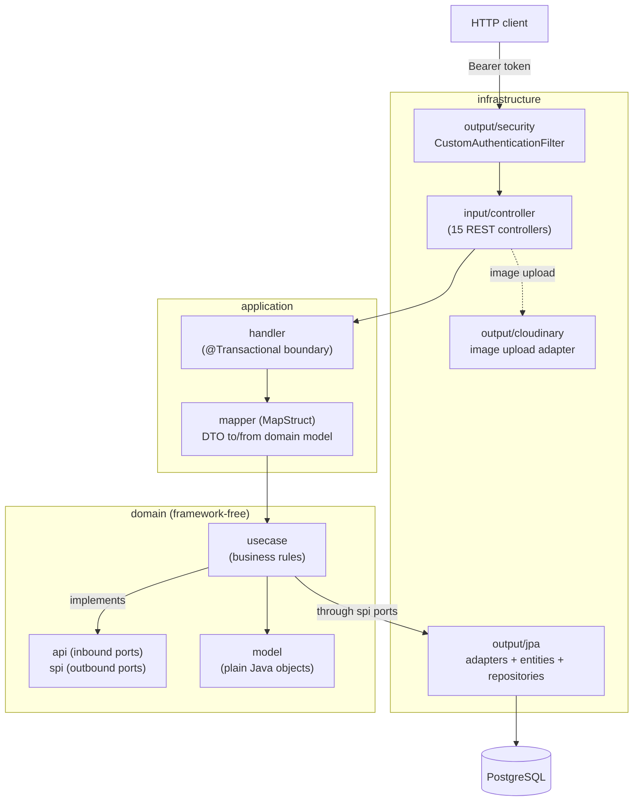

# NegoCore — Backend

A REST API for small-business management: products and stock, clients and
providers, sales and purchases (with partial payments), receivables and
payables, expenses, quotes, pre-sale/pre-purchase orders, an audit log and a
balance report. Built with Spring Boot 3 / Java 21 following a hexagonal
(ports & adapters) architecture.

- **Live API**: https://negocore-backend.onrender.com (Swagger UI at `/swagger-ui/index.html`)
- **Frontend**: https://nego-core-frontend.vercel.app — see the [NegoCore-Frontend](https://github.com/Jhonmario8/NegoCore-Frontend) repo

> The API runs on Render's free tier, which spins the instance down after
> inactivity. The first request after a while can take up to ~1 minute; a
> scheduled GitHub Action pings it every 10 minutes to reduce how often that
> happens (see [`.github/workflows/keep-alive.yml`](.github/workflows/keep-alive.yml)).

## Tech stack

| Concern | Choice |
|---|---|
| Language / runtime | Java 21 |
| Framework | Spring Boot 3.5.4 (Web, Security, Validation, Data JPA) |
| Database | PostgreSQL, via Hibernate with `ddl-auto: update` (no migration tool) |
| Auth | JWT (`jjwt` 0.12.7), stateless, custom filter — no Spring Security `UserDetails` |
| API docs | springdoc-openapi (Swagger UI) |
| Image storage | Cloudinary (product images) |
| Mapping | MapStruct |
| Build | Gradle 9.5 (wrapper included) |
| Tests | JUnit 5 + Mockito |
| CI | GitHub Actions |

## Architecture

The domain layer has **zero Spring or Jakarta imports** — it's plain Java,
independently testable and framework-agnostic. Every use case
(`domain/usecase/*Service.java`) is manually wired into a Spring bean in
[`BeanConfiguration`](src/main/java/com/negocore/infrastructure/config/BeanConfiguration.java);
none of them carry a `@Service` annotation themselves.



Request flow: a controller receives the HTTP request and delegates to an
`application/handler`, which owns the `@Transactional` boundary, maps the
request DTO to a domain model via MapStruct, and calls the matching
`domain/usecase` implementation. The use case enforces business rules and
talks to persistence only through `domain/spi` ports — it never sees an
entity, a repository, or an HTTP concept.

## Features

- **Auth**: register/login, BCrypt-hashed passwords, JWT bearer tokens (10h
  expiration), no refresh tokens.
- **Businesses**: a user can own several; every other resource is scoped to
  a business the requesting user owns.
- **Catalog**: categories, products (stock, low-stock alert threshold,
  optional Cloudinary image).
- **Clients & providers**.
- **Sales**: full or partial payment; a partial sale requires a client and
  automatically opens a `Debt` for the pending balance; cancelling a paid or
  partially-paid sale restores stock (blocked once the linked debt has
  received a payment).
- **Purchases**: full or partial payment; a partial purchase automatically
  opens a `Payable` for the pending balance; increases stock on registration.
- **Debts & payables**: manual payments against the pending balance, plus a
  standalone loan (a `Debt` with no associated sale).
- **Orders**: a pre-sale/pre-purchase draft — add/remove line items, then
  either convert the whole order into a purchase or convert a single item
  into a sale.
- **Expenses**.
- **Quotes**: generated server-side, rendered/exported as an image client-side.
- **Audit log**: a paginated, filterable activity trail per business.
- **Balance report**: income vs. expenses over a date range.

## Getting started

### Prerequisites

- JDK 21
- A PostgreSQL database (local, Docker, or a hosted instance like Neon)

### Configuration

All configuration is via environment variables — nothing is hardcoded, and
no `.env` file is read directly (Spring reads them from the process
environment). None of these have defaults except where noted, so the app
will fail to start without them:

| Variable | Required | Description |
|---|---|---|
| `NC_DB_URL` | yes | JDBC URL, e.g. `jdbc:postgresql://localhost:5432/negocore` |
| `NC_DB_USERNAME` | yes | Database user |
| `NC_DB_PASSWORD` | yes | Database password |
| `NEGOCORE_JWT_KEY` | yes | HMAC signing key for JWTs |
| `NC_CLOUDINARY_CLOUD_NAME` | yes | Cloudinary cloud name |
| `NC_CLOUDINARY_API_KEY` | yes | Cloudinary API key |
| `NC_CLOUDINARY_API_SECRET` | yes | Cloudinary API secret |
| `CORS_ALLOWED_ORIGINS` | no | Comma-separated allowed origins; defaults to the local Vite dev ports |
| `PORT` | no | Server port; defaults to `8080` |

### Run locally

```bash
./gradlew bootRun
```

### Test and build

```bash
./gradlew build
```

## Testing

78 JUnit 5 + Mockito unit tests cover every `domain/usecase` class — pure
business-logic tests with mocked ports, no Spring context and no database.
`NegoCoreApplicationTests.contextLoads()` is disabled at the class level
because it would otherwise boot the full Spring context and require a real
database connection; this keeps `./gradlew build` runnable in CI and on a
laptop with no database configured at all.

There are currently **no integration tests** against the JPA adapters,
repositories, or controllers — see "Known limitations" below.

## CI

[`.github/workflows/ci.yml`](.github/workflows/ci.yml) runs `./gradlew build`
(compile + unit tests) on every push and pull request to `main`.

## Demo data

[`scripts/seed-demo.sh`](scripts/seed-demo.sh) populates a running instance
with a realistic dataset (business, products, clients, sales, purchases,
debts, payables, orders, a quote) using only the public HTTP API. See
[`scripts/README-seed-demo.md`](scripts/README-seed-demo.md) for usage and
limitations.

## Known limitations / possible next steps

Written honestly, not as a to-do list to impress — these are real gaps:

- **No migration tool.** Flyway was removed; the schema evolves via
  Hibernate's `ddl-auto: update`, which is fine for a portfolio project but
  not how a production schema should be managed.
- **No integration tests.** Unit tests cover `domain/usecase` in isolation;
  there's no test hitting a real (or Testcontainers) database through the
  JPA adapters, and no `@WebMvcTest`/`@SpringBootTest` coverage of the
  controllers or the security filter.
- **Ownership checks return 404, not 403.** Referencing another owner's
  business (or a resource under it) returns `NotFoundException` rather than
  a distinguishable "forbidden" response, to avoid confirming the resource
  exists. That's a deliberate tradeoff, but it means a legitimate
  authorization error and a genuine "not found" look identical to the client.
- **No refresh tokens or revocation.** A JWT is valid for its full 10-hour
  window with no server-side blacklist or refresh flow; logout is
  client-side only (the frontend discards the token).
- **No pagination on most list endpoints.** Only `/audit-logs` is paginated;
  products, sales, purchases, clients, etc. return the full list for the
  business, which won't scale past a small catalog.
- **The audit log has no frontend page yet** — the endpoint and its filters
  (date range, action, entity, pagination) exist and work, but nothing in the
  UI surfaces them, and there's no test covering the handler or controller
  layer for it (see "No integration tests" above).
- **No rate limiting** on `/auth/login` or `/auth/register`.
